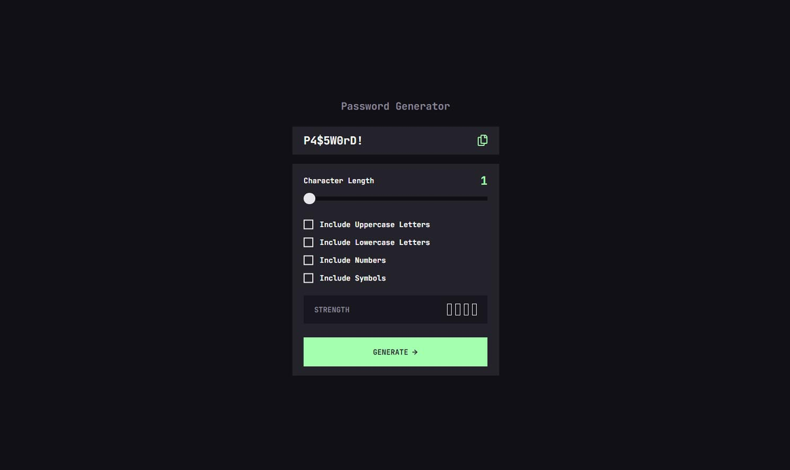

# Frontend Mentor - Notifications page solution

## Table of contents

- [Overview](#overview)
  - [The challenge](#the-challenge)
  - [Screenshot](#screenshot)
  - [Links](#links)
- [My process](#my-process)
  - [Built with](#built-with)
- [Author](#author)

## Overview

### The challenge

Users should be able to:

- Generate a password based on the selected inclusion options
- Copy the generated password to the computer's clipboard
- See a strength rating for their generated password
- View the optimal layout for the interface depending on their device's screen size
- See hover and focus states for all interactive elements on the page

### Screenshot

### Links

- Solution URL: [Solution URL](https://www.frontendmentor.io/solutions/notification-page-with-htmlcssreactjs-k9zzV0Bw0-)
- Live Site URL: [Live site URL](https://cs-tip-calculator.netlify.app/)

### Built with

- Semantic HTML5 markup
- Flexbox
- [Sass](https://sass-lang.com/) - CSS Preprocessor
- [React](https://reactjs.org/) - JS library
- [Gatsby.js](https://www.gatsbyjs.com/) - React framework

## Author

- Website - [Creative Portfolio](https://designer-carlyn.github.io/my-porfolio/)
- Frontend Mentor - [Carlo](https://www.frontendmentor.io/profile/designer-carlyn)
- Linkedin - [Carlo Arlyn Segovia](linkedin.com/in/carlo-arlyn-segovia-a25b33158)
